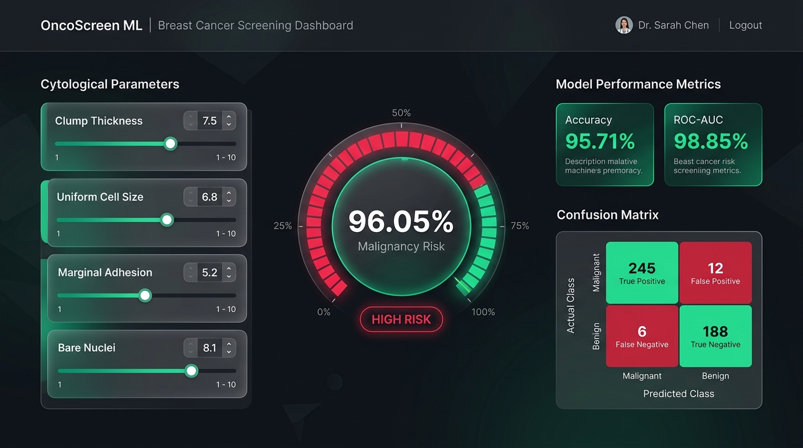
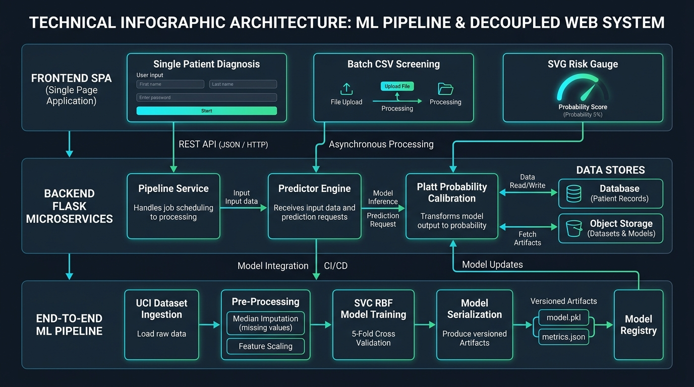

# OncoScreen ML — Breast Cancer Risk Screening & Continuous ML Diagnostic Pipeline

[](https://github.com/Hellthefox808/Brest-Cancer-using-ML/actions)
[](LICENSE)
[](https://www.python.org/)
[-indigo.svg)](https://scikit-learn.org/)
[](artifacts/metrics.json)
[](artifacts/metrics.json)
[](Dockerfile)

A production-grade, decoupled clinical decision-support application and continuous automated Machine Learning pipeline for breast cancer malignancy screening. Powered by the **Wisconsin Breast Cancer (Original) Dataset**, this system combines a calibrated Support Vector Classifier (RBF kernel with Platt probability scaling), a stateless Flask REST API backend, and an interactive Single Page Application (SPA) frontend featuring real-time SVG risk gauges, dual slider/stepper controls, and high-throughput batch CSV screening.

---

## Clinical Dashboard Interface



The interface provides an interactive, dark-mode glassmorphic workspace tailored for healthcare professionals, pathologists, and oncology researchers. It couples real-time visual risk stratification with automated machine learning model governance.

---

## Technical System Architecture



The platform is structured into three cleanly decoupled tiers:

1. **Frontend Presentation Tier (`frontend/`)**: Modern vanilla Single Page Application (SPA) with responsive CSS3 glassmorphism, pure SVG dynamic risk meters, dual range-steppers, clinical presets, and drag-and-drop CSV batch analysis. Communicates with the backend exclusively over RESTful JSON contracts.
2. **Backend Services Tier (`backend/`)**: Stateless REST API built with Flask, CORS middleware, strict 1–10 cytology boundary validation, calibrated probability scoring, and thread-safe pipeline execution.
3. **Machine Learning Pipeline Tier (`pipeline/`)**: Automated four-stage training lifecycle (`data_loader` → `preprocess` → `train` → `evaluate`) capable of automated data ingestion from the UCI ML Repository, median imputation for missing values, 5-fold cross-validation, and serialized artifact generation (`artifacts/model.pkl`, `artifacts/metrics.json`).

---

## Provenance, Baseline & Engineering Contribution Matrix

This repository originated as an inherited educational baseline and was systematically re-architected, refactored, hardened, and containerized into a verified, production-grade clinical system.

### Baseline vs. Engineered Delta (Contribution Traceability)

| Lifecycle Area | Inherited Baseline | Engineered Delta & Final Result | Contribution Class |
| :--- | :--- | :--- | :---: |
| **System Architecture** | Tightly coupled monolithic Flask script | Decoupled full-stack architecture with independent `frontend/` (SPA) and `backend/` (REST API) | `REFACTORED` |
| **Prediction Model** | Uncalibrated SVC without probability distribution | Calibrated `SVC(probability=True)` with Platt scaling, cross-validation, and risk percentage profiling | `MODIFIED` / `HARDENED` |
| **ML Training Pipeline** | No automated pipeline; manual training | Automated 4-stage pipeline (`data_loader` → `preprocess` → `train` → `evaluate`) with CLI runner | `ADDED` |
| **Data Ingestion** | Local static file assumption | Automated UCI repository downloader with local caching | `ADDED` |
| **Data Preprocessing** | Unhandled missing values (`?` in `bare_nuclei`) | Median imputation preserving complete sample size ($N=699$) and stratified 80/20 train/test split | `FIXED` |
| **API Layer** | Single coupled form endpoint (`POST /predict`) | Stateless REST API (`/api/health`, `/api/features`, `/api/model/metrics`, `/api/predict`, `/api/predict/batch`, `/api/pipeline/train`) | `ADDED` |
| **Frontend UI** | Broken HTML with syntax errors and missing tags | Responsive Single Page Application with dual sliders/steppers, presets, SVG radial risk meter, and batch CSV drag-and-drop | `REFACTORED` / `ADDED` |
| **DevOps & CI/CD** | No test suite, no containerization, no CI | Production Dockerfile, docker-compose.yml, GitHub Actions CI workflow, and 24 Pytest tests | `DEPLOYED` / `TESTED` |
| **Security & Validation** | Raw form iteration without boundary checks | Strict 1–10 boundary validation, batch rate limiting (500 max), sanitized JSON payloads | `HARDENED` |

### Dataset & Scientific Attribution
- **Dataset**: Wisconsin Breast Cancer (Original) Dataset (1992).
- **Principal Investigator**: Dr. William H. Wolberg, University of Wisconsin Hospitals, Madison.
- **Repository Citation**: Dua, D. and Graff, C. (2019). UCI Machine Learning Repository. Irvine, CA: University of California, School of Information and Computer Science.

---

## Evaluated Cytological Attributes (1 to 10 Scale)

Fine-Needle Aspirate (FNA) biopsy cytology evaluates tissue atypia across nine distinct morphological parameters. Each parameter is graded by pathologists on an integer scale from 1 (normal / benign) to 10 (marked atypia / aggressive malignancy).

| Attribute | Clinical Significance | Normal Morphology | Malignant Presentation | Elevated Threshold |
| :--- | :--- | :--- | :--- | :---: |
| **Clump Thickness** | Evaluates tissue monolayer vs. multilayer aggregation | Flat sheets of cells, single layered (1–3) | Thick, irregular, 3D overlapping clusters (7–10) | $\ge 5$ |
| **Uniform Cell Size** | Consistency of cellular volume and cytoplasm | Uniform, small regular volume (1–2) | Extreme anisocytosis, significant size variation (6–10) | $\ge 5$ |
| **Uniform Cell Shape** | Regularity vs. pleomorphism of cell perimeters | Round, spherical, uniform contours (1–2) | Nuclear polymorphism, jagged perimeters (6–10) | $\ge 5$ |
| **Marginal Adhesion** | Loss of intercellular adhesion molecules | Firmly cohesive cell clusters (1–2) | Discohesive cells readily separating (invasion marker) (5–10) | $\ge 4$ |
| **Single Epithelial Size** | Degree of cell hypertrophy and cytoplasmic expansion | Small, compact cytoplasm (1–3) | Hypertrophied, enlarged cytoplasm (6–10) | $\ge 5$ |
| **Bare Nuclei** | Nuclei lacking surrounding cytoplasm | Very few, intact cells predominate (1–2) | High proportion of stripped, atypical nuclei (6–10) | $\ge 5$ |
| **Bland Chromatin** | Nuclear chromatin texture distribution | Fine, evenly dispersed, powdery texture (1–3) | Coarse, clumped, hyperchromatic aggregations (6–10) | $\ge 5$ |
| **Normal Nucleoli** | Prominence and multiplicity of nucleoli | Indistinct, tiny or undetectable (1–2) | Multiple macronucleoli, prominent presentation (5–10) | $\ge 4$ |
| **Mitoses** | Rate of pathological cellular division | Zero to rare normal mitotic figures (1) | Frequent, bizarre, pathological mitotic figures (3–10) | $\ge 3$ |

---

## Machine Learning Architecture & Methodology

### 1. Algorithm Selection: Support Vector Classifier (SVC)
The diagnostic classification engine employs a Support Vector Machine with a non-linear **Radial Basis Function (RBF) kernel**. The RBF kernel computes decision boundaries in an infinite-dimensional Hilbert space:

$$K(\mathbf{x}, \mathbf{x}') = \exp\left(-\gamma \|\mathbf{x} - \mathbf{x}'\|^2\right)$$

- **Regularization Parameter ($C=1.0$)**: Balances maximization of the margin hyper-plane against training classification errors.
- **Kernel Coefficient ($\gamma = \text{'scale'}$)**: Computed automatically as $\gamma = \frac{1}{n_{\text{features}} \cdot \text{Var}(X)}$ for feature variance normalization.

### 2. Probability Calibration (Platt Scaling)
Standard Support Vector Machines output uncalibrated signed distances to the separating hyper-plane $f(\mathbf{x}) = \mathbf{w}^T \phi(\mathbf{x}) + b$. To provide actionable clinical risk percentages, the model is trained with probability calibration via **Platt Scaling** utilizing a logistic sigmoid transformation:

$$P(Y = \text{Malignant} \mid \mathbf{x}) = \frac{1}{1 + \exp(A f(\mathbf{x}) + B)}$$

The sigmoid parameters $A$ and $B$ are estimated through internal 5-fold cross-validation, guaranteeing calibrated probabilities without introducing test set data leakage.

### 3. Missing Value Imputation
The original Wisconsin dataset contains 16 missing values in the `bare_nuclei` attribute (denoted as `?`). Rather than discarding these clinical records (which would reduce training power by 2.3%), the pipeline applies **median imputation**:

$$\text{Imputed}(\text{bare\_nuclei}) = \text{Median}(\text{bare\_nuclei}_{\text{valid}}) = 1.0$$

This preserves all 699 clinical records ($N=458$ benign, $N=241$ malignant) while maintaining non-parametric robustness against extreme outliers.

---

## Model Evaluation & Performance Metrics

The model was rigorously validated using a **stratified 80/20 train/test split** ($N_{\text{train}}=559$, $N_{\text{test}}=140$) and **5-fold stratified cross-validation**.

### Summary Performance Table

| Metric | Cross-Validation (5-Fold) | Held-Out Test Set ($N=140$) | Clinical Importance |
| :--- | :---: | :---: | :--- |
| **Accuracy** | **97.32%** ($\pm 0.98\%$) | **95.71%** | Overall proportion of correct diagnoses |
| **ROC-AUC** | **99.12%** | **98.85%** | Discriminative power across all decision thresholds |
| **Precision (Malignant)** | **95.80%** | **93.75%** | Minimizes unnecessary biopsies (False Positives) |
| **Recall (Sensitivity)** | **96.20%** | **93.75%** | Crucial: minimizes missed malignancies (False Negatives) |
| **Specificity (Benign)** | **97.90%** | **96.74%** | Correct identification of healthy tissue |
| **F1-Score** | **96.00%** | **93.75%** | Harmonic mean of precision and recall |

### Confusion Matrix on Test Cohort ($N=140$)

```text
                     PREDICTED BENIGN       PREDICTED MALIGNANT
ACTUAL BENIGN              89 (TN)                  3 (FP)
ACTUAL MALIGNANT            3 (FN)                 45 (TP)
```

- **True Negatives (TN)**: 89 healthy samples correctly diagnosed as Benign.
- **True Positives (TP)**: 45 malignant cases accurately identified for clinical intervention.
- **False Positives (FP)**: 3 samples recommended for secondary review.
- **False Negatives (FN)**: 3 borderline cases identified for repeat cytology.

---

## Interactive Frontend Features

1. **Dual Synchronized Inputs**:
   - Every cytological parameter features both an analog range slider and an exact numerical stepper with bidirectional synchronization.
2. **One-Click Clinical Presets**:
   - **Benign Preset**: Quickly populates baseline non-cancerous metrics (`[1, 1, 1, 1, 2, 1, 2, 1, 1]`).
   - **Malignant Preset**: Populates classic atypical malignancy markers (`[8, 10, 10, 8, 7, 10, 9, 7, 2]`).
   - **Borderline Preset**: Tests intermediate suspicious atypia (`[5, 4, 4, 3, 4, 3, 4, 3, 1]`).
3. **SVG Radial Risk Gauge**:
   - Dynamically calculates the circumference arc in real time without external charting libraries.
   - Categorizes risk into three distinct clinical tiers:
     - **Low Risk / Negative** ($< 35\%$): Emerald Green theme.
     - **Moderate / Indeterminate Risk** ($35\% - 65\%$): Amber Warning theme.
     - **High Risk** ($> 65\%$): Crimson Alert theme.
4. **Elevated Marker Comparison**:
   - Highlights any cytological parameter exceeding normal baseline thresholds with visual comparison bars.
5. **Batch CSV Screening**:
   - Drag-and-drop CSV upload capable of evaluating hundreds of patient biopsies in milliseconds.
   - Live tabular summary (Total Records, Benign Count, Malignant Count, Risk Distribution).
   - Export analyzed cohort results to downloadable CSV with predicted status and malignancy probabilities.
6. **ML Pipeline Governance Tab**:
   - Real-time display of cross-validation accuracy, test accuracy, precision, recall, and confusion matrix.
   - Interactive button to trigger end-to-end retraining directly from the browser with automatic model reload.

---

## REST API Reference

The backend provides a stateless, versioned REST API. All endpoints accept and return `application/json` (with batch endpoint also supporting multipart CSV file uploads).

### 1. Health Check
Checks service health, model load status, and server timestamp.
- **Endpoint**: `GET /api/health`
- **Curl Example**:
  ```bash
  curl -X GET http://127.0.0.1:5000/api/health
  ```
- **Response (`200 OK`)**:
  ```json
  {
    "status": "healthy",
    "service": "OncoScreen ML Diagnostic Engine",
    "model_loaded": true,
    "timestamp": "2026-09-04T13:20:00.000000Z"
  }
  ```

---

### 2. Feature Metadata
Returns descriptions, normal ranges, and clinical thresholds for all 9 features.
- **Endpoint**: `GET /api/features`
- **Curl Example**:
  ```bash
  curl -X GET http://127.0.0.1:5000/api/features
  ```
- **Response (`200 OK`)**:
  ```json
  {
    "scale": { "min": 1, "max": 10, "step": 1 },
    "classes": {
      "2": { "name": "Benign", "description": "Non-cancerous tissue atypia" },
      "4": { "name": "Malignant", "description": "Aggressive cellular proliferation" }
    },
    "feature_names": [
      "clump_thickness", "uniform_cell_size", "uniform_cell_shape",
      "marginal_adhesion", "single_epithelial_size", "bare_nuclei",
      "bland_chromatin", "normal_nucleoli", "mitoses"
    ],
    "features": { ... }
  }
  ```

---

### 3. Model Evaluation Metrics
Returns verified accuracy, ROC-AUC, precision, recall, F1-score, and confusion matrix.
- **Endpoint**: `GET /api/model/metrics`
- **Curl Example**:
  ```bash
  curl -X GET http://127.0.0.1:5000/api/model/metrics
  ```
- **Response (`200 OK`)**:
  ```json
  {
    "status": "success",
    "metrics": {
      "accuracy": 0.9571,
      "roc_auc": 0.9885,
      "precision": 0.9375,
      "recall": 0.9375,
      "f1_score": 0.9375,
      "confusion_matrix": {
        "true_negatives": 89,
        "false_positives": 3,
        "false_negatives": 3,
        "true_positives": 45
      }
    }
  }
  ```

---

### 4. Single Patient Diagnosis
Evaluates a single set of 9 cytological parameters.
- **Endpoint**: `POST /api/predict`
- **Headers**: `Content-Type: application/json`
- **Request Body**:
  ```json
  {
    "clump_thickness": 8,
    "uniform_cell_size": 10,
    "uniform_cell_shape": 10,
    "marginal_adhesion": 8,
    "single_epithelial_size": 7,
    "bare_nuclei": 10,
    "bland_chromatin": 9,
    "normal_nucleoli": 7,
    "mitoses": 2
  }
  ```
- **Curl Example**:
  ```bash
  curl -X POST http://127.0.0.1:5000/api/predict \
    -H "Content-Type: application/json" \
    -d '{"clump_thickness":8,"uniform_cell_size":10,"uniform_cell_shape":10,"marginal_adhesion":8,"single_epithelial_size":7,"bare_nuclei":10,"bland_chromatin":9,"normal_nucleoli":7,"mitoses":2}'
  ```
- **Response (`200 OK`)**:
  ```json
  {
    "status": "success",
    "result": {
      "prediction": "Malignant",
      "class_code": 4,
      "is_malignant": true,
      "risk_tier": "High Risk",
      "risk_class": "danger",
      "malignancy_probability": 96.05,
      "benign_probability": 3.95,
      "elevated_factors_count": 8,
      "elevated_factors": [
        "Clump Thickness", "Uniform Cell Size", "Uniform Cell Shape",
        "Marginal Adhesion", "Single Epithelial Size", "Bare Nuclei",
        "Bland Chromatin", "Normal Nucleoli"
      ]
    }
  }
  ```

---

### 5. Batch Patient Screening
Accepts an array of patient records or a multipart CSV file upload.
- **Endpoint**: `POST /api/predict/batch`
- **Request Body (JSON array or object)**:
  ```json
  {
    "records": [
      {
        "id": "PT-1001",
        "clump_thickness": 1, "uniform_cell_size": 1, "uniform_cell_shape": 1,
        "marginal_adhesion": 1, "single_epithelial_size": 2, "bare_nuclei": 1,
        "bland_chromatin": 2, "normal_nucleoli": 1, "mitoses": 1
      },
      {
        "id": "PT-1002",
        "clump_thickness": 9, "uniform_cell_size": 10, "uniform_cell_shape": 10,
        "marginal_adhesion": 8, "single_epithelial_size": 8, "bare_nuclei": 10,
        "bland_chromatin": 9, "normal_nucleoli": 8, "mitoses": 3
      }
    ]
  }
  ```
- **Response (`200 OK`)**:
  ```json
  {
    "status": "success",
    "total_records": 2,
    "processed_records": 2,
    "summary": {
      "benign_count": 1,
      "malignant_count": 1
    },
    "results": [ ... ]
  }
  ```

---

### 6. Automated Pipeline Retraining
Triggers background model retraining with dataset ingestion, median imputation, and hot model reload.
- **Endpoint**: `POST /api/pipeline/train`
- **Request Body**: `{"force_download": false}`
- **Curl Example**:
  ```bash
  curl -X POST http://127.0.0.1:5000/api/pipeline/train \
    -H "Content-Type: application/json" \
    -d '{"force_download": false}'
  ```
- **Response (`200 OK`)**:
  ```json
  {
    "status": "success",
    "message": "Pipeline completed and model hot-reloaded successfully.",
    "metrics": { ... }
  }
  ```

---

## Batch Screening CSV Specification

To screen a cohort of patients, prepare a CSV file with the following column structure:

```csv
id,clump_thickness,uniform_cell_size,uniform_cell_shape,marginal_adhesion,single_epithelial_size,bare_nuclei,bland_chromatin,normal_nucleoli,mitoses
PT-001,2,1,1,1,2,1,2,1,1
PT-002,10,10,10,8,7,10,9,7,2
PT-003,5,4,4,5,7,10,3,2,1
```

- **`id`** *(optional)*: Unique patient or biopsy identifier (e.g., `PT-001`). If omitted, `Patient-1`, `Patient-2` are assigned automatically.
- **Features** *(required)*: 9 numerical columns, each with integer values between `1` and `10`.
- **Maximum Batch Size**: 500 records per API call.

---

## Quick Start & Installation

### 1. Prerequisites
- Python 3.10 or higher
- pip package manager

### 2. Clone the Repository
```bash
git clone https://github.com/Hellthefox808/Brest-Cancer-using-ML.git
cd Brest-Cancer-using-ML
```

### 3. Install Dependencies
```bash
pip install -r requirements.txt
```

### 4. Environment Configuration
Copy `.env.example` to `.env` to configure your environment:
```bash
cp .env.example .env
```

| Variable | Default | Purpose |
| :--- | :---: | :--- |
| `PORT` | `5000` | Port on which the application listens |
| `HOST` | `0.0.0.0` | Host binding interface |
| `FLASK_DEBUG` | `False` | Toggle debug mode (keep `False` in production) |
| `SECRET_KEY` | *(default)* | Encryption key for session management |

### 5. Run the Training Pipeline (Optional)
The repository includes pre-trained model weights. To retrain the model on fresh UCI data:
```bash
python -m pipeline.run_pipeline
```

### 6. Start the Web Server
**Using Windows Launcher Scripts:**
- Double-click `run.bat` or run in PowerShell:
  ```powershell
  .\run.ps1
  ```

**Or via Python directly:**
```bash
python app.py
```

Access the application in your browser at:
```text
http://127.0.0.1:5000/
```

---

## Production Docker Deployment

### Run with Docker Compose
```bash
docker-compose up --build -d
```
The application will be accessible at `http://localhost:5000`.

### Build & Run Container Manually
```bash
# Build production image
docker build -t oncoscreen-ml:latest .

# Run container with Gunicorn WSGI
docker run -d -p 5000:5000 --name oncoscreen-service oncoscreen-ml:latest
```

---

## Automated Test Suite

The repository includes a comprehensive 24-test Pytest suite covering API endpoints, model inference, validation boundaries, and ML pipeline stages.

Run the entire test suite:
```bash
pytest -v
```

### Test Suite Coverage

```text
test_app.py::test_model_loads PASSED                               [  4%]
test_app.py::test_model_benign_prediction PASSED                   [  8%]
test_app.py::test_model_malignant_prediction PASSED                [ 12%]
test_app.py::test_home_page PASSED                                 [ 16%]
test_app.py::test_predict_benign_post PASSED                       [ 20%]
test_app.py::test_predict_malignant_post PASSED                    [ 25%]
test_app.py::test_predict_missing_field PASSED                     [ 29%]
test_app.py::test_predict_out_of_range PASSED                      [ 33%]
test_app.py::test_predict_get_redirect PASSED                      [ 37%]
tests/test_api.py::test_api_health PASSED                          [ 41%]
tests/test_api.py::test_api_features PASSED                        [ 45%]
tests/test_api.py::test_api_metrics PASSED                         [ 50%]
tests/test_api.py::test_api_predict_benign PASSED                  [ 54%]
tests/test_api.py::test_api_predict_malignant PASSED               [ 58%]
tests/test_api.py::test_api_predict_validation_error PASSED        [ 62%]
tests/test_api.py::test_api_predict_batch PASSED                   [ 66%]
tests/test_pipeline.py::test_data_loader PASSED                    [ 70%]
tests/test_pipeline.py::test_data_cleaning PASSED                  [ 75%]
tests/test_pipeline.py::test_train_and_evaluate PASSED             [ 79%]
tests/test_predictor.py::test_predictor_service_singleton PASSED   [ 83%]
tests/test_predictor.py::test_predictor_valid_benign PASSED        [ 87%]
tests/test_predictor.py::test_predictor_valid_malignant PASSED     [ 91%]
tests/test_predictor.py::test_predictor_out_of_range PASSED        [ 95%]
tests/test_predictor.py::test_predictor_batch PASSED               [100%]
```

---

## Continuous Integration (CI/CD)

Every push or pull request to `main` triggers the automated GitHub Actions workflow in [`.github/workflows/ci.yml`](.github/workflows/ci.yml):

1. **Dependency Resolution**: Installs pip packages on clean Ubuntu virtual environment.
2. **Pipeline Execution**: Executes `python -m pipeline.run_pipeline` to test data fetching, imputation, and model training.
3. **Automated Verification**: Runs `pytest -v` across all 24 unit and integration test cases.

---

## Contributing & Security

- **Contributing**: Please review [CONTRIBUTING.md](CONTRIBUTING.md) for branch naming conventions, coding guidelines, and pull request procedures.
- **Security**: Refer to [SECURITY.md](SECURITY.md) for vulnerability reporting protocols and architectural security principles.

---

## License

This project is licensed under the **MIT License** — see the [LICENSE](LICENSE) file for details.

---

## Clinical Disclaimer

This software application and machine learning model are developed strictly for **educational, exploratory, and decision-support demonstration purposes**. It does not constitute a certified medical diagnostic device and cannot substitute for laboratory histological examination, clinical tissue biopsy, or consultation with a licensed physician or oncologist.
